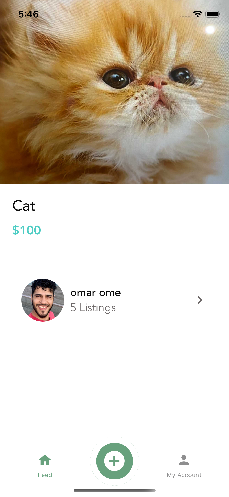

# myOnlinePetShop
## PetStore


## About the project
This is PetStore, app for people looking to buy or sell their pet. Made to look simple and easy to use with ReactNative. People can contact eachother and get to know more about the pet.

********************************************************************************
 

 

 

 


### Built With

* []() 
* []() React Native
* []() 

<!-- GETTING STARTED -->
## Getting Started

To get a local copy up and running follow these simple steps.


### Installation

1. Clone the repo
   ```sh
   git clone https://github.com/Jonnboy91/Asuntosi.git
   ```
2. Install NPM packages
   ```sh
   npm install
   ```
3. Database
   ```sh
   Run the backend with the front end at the same time
   ```
   ```
5. Run the app locally
   ```sh
   npm start
   ```

<!-- CONTACT -->
## Contact


#Alexander Dedikova
#Omar Al-Mashhadani
#Karim Moubarik


Project Link: [https://github.com/omarome/myOnlinePetShop)


<!-- ACKNOWLEDGEMENTS -->
## Acknowledgements

* []() Thanks for everyone who helped with the project!

<!-- LICENSE -->
## IT-Players
[]() &copy; 2021


